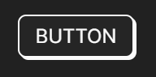
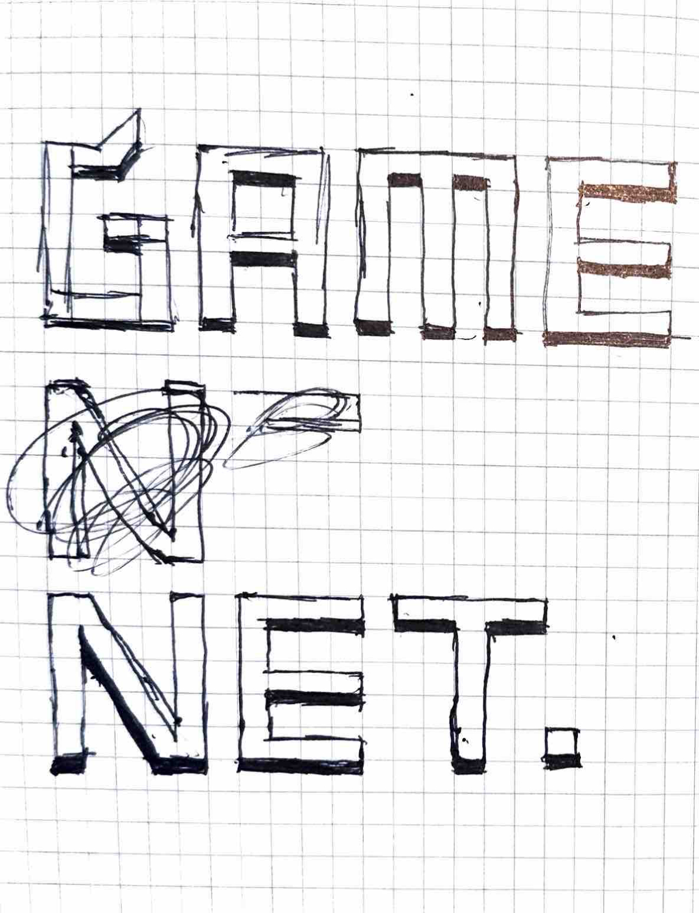
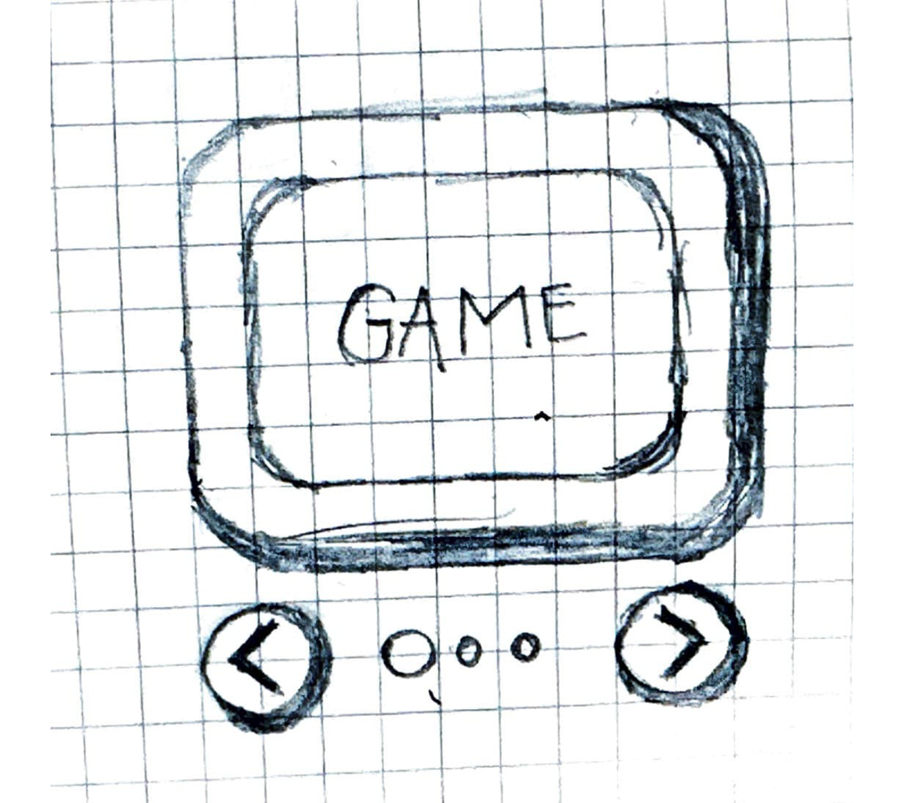
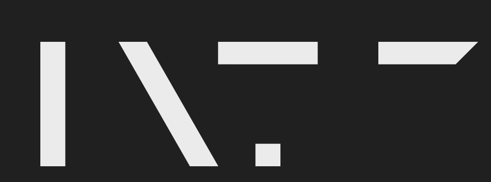
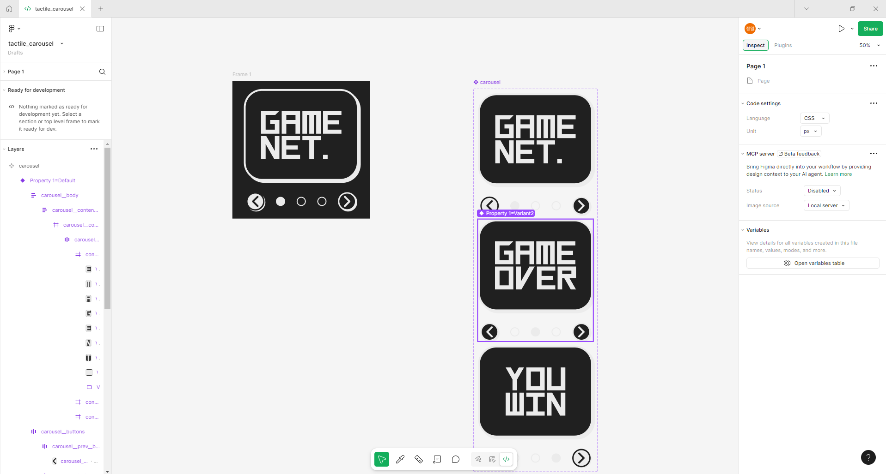

# 3주차 과제

3주차 과제는 3갈래 길이 있었는데 제공된 피그마 컴포넌트를 구현하는 것,
기존 사이트의 컴포넌트의 문제점을 개선하는 것 그리고 직접 디자인 구상해서
구현하는 것이 있었는데 저는 3번 제가 직접 디자인 구상해서 구현하는 것으로
가닥을 잡았습니다.

## 목차

## 1. 디자인 레퍼런스

[UIVerse Button](https://uiverse.io/levxyca/tidy-mayfly-7)  
  
UIVerse의 버튼 요소를 찾아 보던중 미니멀하게 입체감을 주는
버튼 컴포넌트를 발견했습니다.

제가 아이디어 스케치만 했던 브랜드 GAMENET. 로고에 딱 맞는 스타일이라고 생각했습니다. 이제 이 스타일을 확장해서 캐러셀을 구현하기 위한 아이디어 스케치 단계를 시작했습니다.

## 2. 아이디어 스케치


일단 아이디어 스케치 단계에서는 예전에 고전 게임 했던 감성으로
TV 화면과 조작키의 조합으로 보일 수 있는 스타일을 추구했습니다.

## 3. 로고 및 텍스트 메이킹

로고를 하던게 있었지만 여기서 똑같이 로고만 가져가기 보다 아예 쓸 글자들을
디자인적으로만 쓸수 있는 폰트로 직접 만들어서 다양한 텍스트로 견본을 만들어보자고 생각했습니다.


어차피 간단한 형태의 텍스트가 될 것이고 작은 크기를 신경 안써도
되는 디스플레이 폰트라서 간단하게 5가지 요소만 가지고 조합해서 만들 수 있었습니다.


## 4. 피그마로 프로토타이핑


피그마를 이용해서 처음으로 웹결과물을 제대로 냈습니다. 야무쌤
이메일이 없어서 share는 못했고요. 컴포넌트로 만들고 바리언트를 만든 후
버튼 연결을 통해 이동할 수 있게 만든 프로토타입이예요.

## HTML 마크업

```html
<section class="carousel">
  <div class="carousel__container">
    <ul class="carousel__contents">
      <li class="carousel__content">
        <a href="#"></a>
      </li>
      <li class="carousel__content">
        <a href="#"></a>
      </li>
      <li class="carousel__content">
        <a href="#"></a>
      </li>
    </ul>
  </div>
  <div class="carousel__controls">
    <button type="button" class="carousel__prev__button">
      
    </button>
    <div class="carousel__indicator">
      <button
        type="button"
        class="carousel__indicator__button"
        aria-label="1번째 페이지"
      ></button>
      <button
        type="button"
        class="carousel__indicator__button"
        aria-label="2번째 페이지"
      ></button>
      <button
        type="button"
        class="carousel__indicator__button"
        aria-label="3번째 페이지"
      ></button>
    </div>
    <button type="button" class="carousel__next__button">
      
    </button>
  </div>
</section>
```

초기 마크업은 이랬습니다. 강사님이 제공해주신 마크업에서 참고해서
작성했는데 carousel\_\_contents에 translateX를 적용하니 박스가 통째로 이동하는
문제가 발생했습니다. 그래서 carousel\_\_body라는 div 요소를 carousel\_\_container
위에 만들고 css 조정해서 해결했습니다.

```html
<section class="carousel">
  <div class="carousel__body">
    <div class="carousel__container">
      <ul class="carousel__contents">
        <li class="carousel__content">
          <a href="#"></a>
        </li>
        <li class="carousel__content">
          <a href="#"></a>
        </li>
        <li class="carousel__content">
          <a href="#"></a>
        </li>
      </ul>
    </div>
  </div>
  <div class="carousel__controls">
    <button type="button" class="carousel__prev__button">
      
    </button>
    <div class="carousel__indicator">
      <button
        type="button"
        class="carousel__indicator__button"
        aria-label="1번째 페이지"
      ></button>
      <button
        type="button"
        class="carousel__indicator__button"
        aria-label="2번째 페이지"
      ></button>
      <button
        type="button"
        class="carousel__indicator__button"
        aria-label="3번째 페이지"
      ></button>
    </div>
    <button type="button" class="carousel__next__button">
      
    </button>
  </div>
</section>
```

## CSS 스타일링

스타일링은 피그마에 있으니 그대로 따라가고 강사님이 주셨던 예제 참고해서
섞고 테스트하면서 작성했습니다.
그리고 disable 스타일이 적용이 안되어서 클래스로 is-unactive를 적용하고
스타일링을 해봤습니다.

## JS 로직

JS로직은 전에 제가 구현했던 것이 있기에 참고해서 작성했습니다. 전에 2주차
과제에서 썼던 것처럼은 못하는데 이유는 role같은 특성에 대한 정확한 이해를
아직 못했기 때문입니다. 비활성 객체에 대한 tabindex처리와 aria-disabled같은
속성을 js에서 적용하여 키보드 접근성을 높였습니다. init함수로 이벤트 핸들러
추가를 분리하여서 init(index)함수를 HTML 블럭에서 실행하게 해서 초기화를
진행하게 했습니다.

## 느낀점

새벽 늦게까지 과제를 하느라 힘들었지만 그래도 대학교 때 생각나고 좋았습니다.
