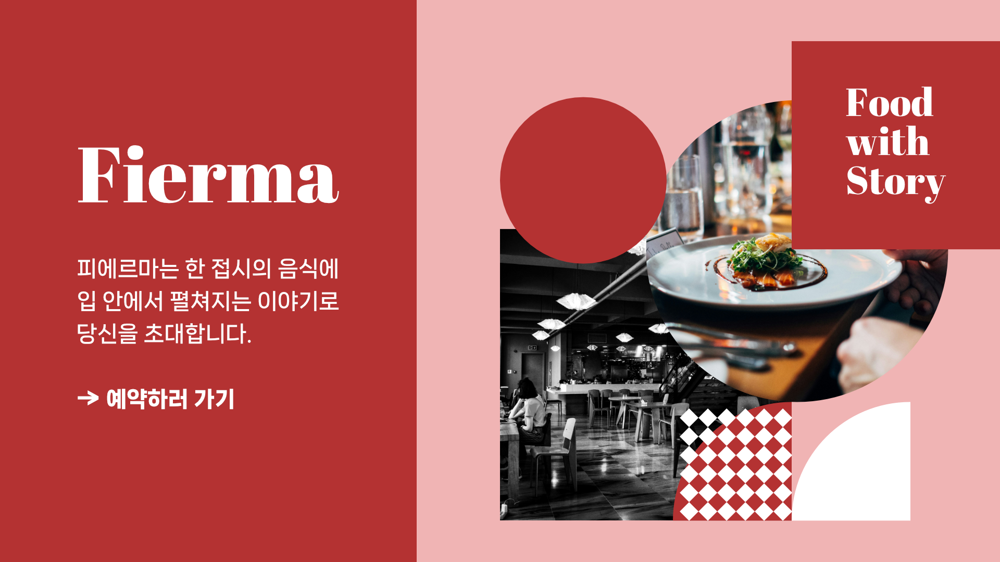

# 4주차 회고

4주차는 애니메이션 관련 과제를 받았습니다. gsap을 이용해서 이것저것 구현해봤습니다.

## 디자인

먼저 제가 익숙한 툴중 하나인 affinity designer를 활용하여 디자인 시안을 만들어봤습니다.



## 구현

전에 주셨던 gsap 예제 마크업을 참고하여 구현했습니다.
그리드가 더 쉬워서 구조화하기 그리드로 했으며 디자인 시안과는 조금 다르게 구현됐습니다.

## 문제점

### Opacity 0가 그대로 유지되는 문제

```js
{
  const tl = gsap.timeline();
  
  tl.from(".banner__title", { y: 80, duration: 0.8 })
    .from(".banner__description", { opacity: 0, y: 20, duration: 0.4 }, "-=0.3")
    .from(".banner__link", { opacity: 0, y: 20, duration: 0.4 }, "-=0.3")
    .from(".banner__image", { opacity: 0, duration: 0.4, stagger: 0.1 }, "-=0.3");
}
```

이렇게 작성하면 opacity 0이 되는 문제가 생겼습니다.

```js
const tl = gsap.timeline();

tl.from('.banner__title', { y: 80, duration: 1, delay: 0.2 })
  .from('.banner__description', { opacity: 0, y: 20, duration: 0.8 }, '<-0.3')
  .from('.banner__link', { opacity: 0, y: 20, duration: 0.6 }, '<-0.3')
  .from('.banner__image', { opacity: 0, y: 20, duration: 0.6, stagger: 0.2 }, "<-0.3");
```

그래서 이렇게 작성해서 해결했습니다. 왜 그런지 모르겠는데 애니메이션 연결 시점을 이리저리 바꿔보니까 되더라고요;;
그리고 .banner__image span에는 애니메이션이 적용이 안되는데 이것도 왜 그런지 모르겠습니다.

## 느낀점

분명히 강사님하고 했을 때는 잘 됐던 거 같은데 직접 적용해보니까 굉장히 어려웠습니다.
그리고 전혀 모르겠는 버그들이 많아서 고생했던 거 같아요.
